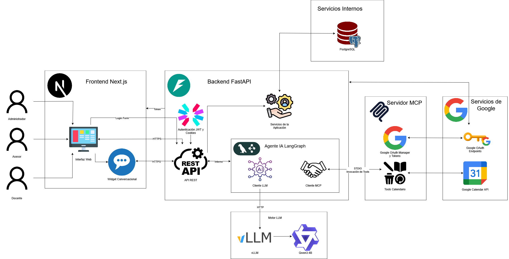

# Proyecto CINAP

Sistema de agendamiento inteligente para tutores y estudiantes de la Universidad Católica de Temuco.  
El proyecto integra **IA conversacional**, **Google Calendar** y una arquitectura moderna basada en cuatro componentes principales:

- **Frontend (Next.js):** interfaz de usuario web.  
- **Backend (FastAPI):** lógica de negocio y API REST.  
- **Servidor MCP (Calendar/LLM):** integración con LLM y orquestación de eventos de calendario.  
- **Servidor MCP (Base de Datos):** puente del LLM hacia PostgreSQL para consultas/operaciones controladas.  

El proyecto sigue principios de **Arquitectura Limpia**, manteniendo una clara separación de responsabilidades en cada componente.

---

## Arquitectura



- El **frontend** ofrece la interfaz con la que interactúan tutores y estudiantes.  
- El **backend** maneja la lógica de negocio, persistencia y comunicación entre servicios.  
- El **servidor MCP (Calendar/LLM)** permite al LLM manipular Google Calendar (crear, listar, actualizar y eliminar eventos).  
- El **servidor MCP (Base de Datos)** permite al LLM consultar y operar datos de CINAP en PostgreSQL con reglas de negocio.  

---

## Requisitos generales

- **Node.js** >= 22.18
- **Python** >= 3.13  
- **Docker Engine** >= 28.3.3
- Credenciales de **Google Cloud** para Calendar API  

---

## Requisitos adicionales

### Infraestructura
- **Redis** >= 7-alpine
- **PostgreSQL** >= 17

### Motor de IA
- **vLLM** >= 0.10.1.1

### Integraciones externas
- Credenciales de **Telegram Bot API**

---

## Instalación rápida

Clona el repositorio y accede al directorio:

```bash
git clone https://github.com/patoskixd/Proyecto-Cinap.git
cd Proyecto-Cinap
```

Cada componente tiene sus propias instrucciones específicas:

- [Frontend (Next.js)](./cinap/README.md)  
- [Backend (FastAPI)](./backend_fastapi/README.md)  
- [Servidor MCP (Calendar/LLM)](./mcp_server/README.md)  
- [Servidor MCP (Base de Datos)](./mcp_cinap/README.md)  

---

## Componentes

### Frontend
Interfaz web desarrollada en **Next.js**.  
Permite agendar, visualizar y gestionar tutorías.

---

### Backend
API REST construida en **FastAPI**.  
Expone casos de uso y conecta con el servidor MCP.

---

### Servidor MCP (Calendar/LLM)
Implementa herramientas (`event_create`, `event_list`, `event_update`, etc.) para interactuar con **Google Calendar** mediante un LLM.  

### Servidor MCP (Base de Datos)
Permite consultas y operaciones controladas sobre la base de datos PostgreSQL de CINAP (disponibilidad, asesorías, metadatos), siempre aplicando las reglas de negocio.  

